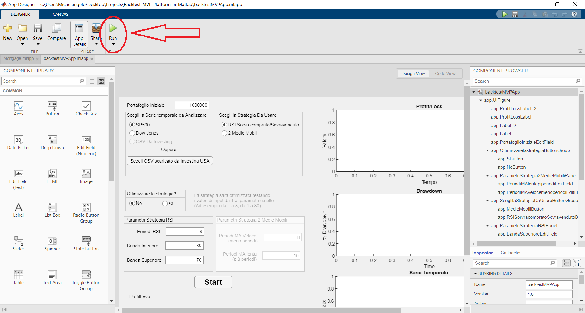

# MVP Backtest platform

# Objective

Create a script that manages a complete backtest and optimizes a trading strategy (built relying on one or more indicators) given a stock CSV downloaded from [Investing USA](https://www.investing.com/).

# **Notes on the Project**

1. It's written in vanila Matlab, external packages has not been used as I aimed to code everything from scratch
2. I have made extensive use of Object Oriented Programming in Matlab *(i.e. indicators, portfolio, orders and strategies are Objects)*
3. The project goes from zero to production (software publication)

# How to start it

There are 2 ways:

1. Install the standalone app by clicking on **"MyAppInstaller_web.exe"** (maybe the antivirus will trigger, it's ok)
2. Open the Matlab software, open the project, double click on "backtestMVPApp.mlapp", App Designer will appear and then click on "Run"(it's on the upper toolbar)

Then, Click On "Start"

NOTE: if you want to uninstall and you have Windows as operative system just go on "Pannello di Controllo", then  "Disinstalla un programma", then uninstall "backtestMVPapp"

# How it works

## 1) User information input and data gathering

1. The user inserts the type of **stocks she wants to analyze or uploads a CSV** with the dedicated button.
2. The user chooses the **amount of money of the portfolio**.
3. The user chooses the **type of strategy** she wants to backtest.
4. **If she wants to just backtest or optimize** the parameters(find the best parameters to have a high profit and low drawdown)

## 2) Data Filtering and Validation

Data downloaded could have outliers, missing data  (maybe the data for the data interval provided is not available) or just weird data such as a string of text instead of the price: the data needs to be treated and analyzed in order to solve these problems.

In order to spot outliers, the code will check for first if the data requested for the interval exists (is the data available from and to the dates the user provided?).

Moreover, the timeseries will be scanned to check if there is missing data:

If some points of the timeseries are missing, they will be filled by the mean between the left and right point of the timeseries.
The new data used as a fill for the missing points will be calculated as:

$m=(y_2-y_1)/(x_2-x_1)$

$q=y_2-m\cdot y_1$

$P_t=t\cdot m+q$

## 3) Backtest of the strategy and creation of sell and buy orders

If the Strategy chosen is the **2 Moving Average**: 
BUY if the faster MA crosses upperward the slower one

SELL if the faster MA crosses downward the slower one

If the Strategy chosen is the **RSI Overbought /  Oversold**: 
BUY if the RSI goes below the lowerband 

SELL  if the RSI goes above the upperband 

### Order Logic

For each element of the timeseries (for each close price) the backtest will do these tasks:

1. check if there are orders to close (in stop loss or take profit)
2. check if the portfolio is less than 0
3. check if the strategy signals something("BUY", "SELL", "IDLE")
4. the logic flow in the above image 

## 4) Analysis of the data collected

there will be collected information as:

- Profit/Loss
- Variance of the portfolio
- % Max Drawdown
- Sharpe Ratio (with risk free rate  = 0)
- A Chart of the profit/loss

## Optimization of "optimizable input parameters"

The Inputs of the indicators aren't fine tuned as they're chosen by the user or hardcoded in the script *i.e.(order size, order take profit, order stop loss)*.

The software will cycle from 1 to the input parameter and will find the optimal portfolio based on sharpe ratio.

**N.B. PLEASE do not use high values for the parameters as it would take HOURS
I suggest to use the 2 Moving Average Strategy with parameters 4 and 8 (so that (8-1)*4= 28 scenarios)
Each scenario takes almost 2 to 4 seconds to be tested depending on the size of the dataset(so, also, do not use huge timeseries)**

Why this happens? Because matlab  has performance issues when dealing with object. 
Source:

- [Matlab Forum Link 1](https://it.mathworks.com/matlabcentral/answers/30998-array-of-objects-speed-issues)
- [Matlab Forum Link 2](https://blogs.mathworks.com/loren/2012/03/26/considering-performance-in-object-oriented-matlab-code/)

# Standalone App

There are 3 ways to publish a Matlab Script: creating a **Webapp** (this solution would need a server), creating an **app** (that will be added to the matlab apps on the device), create a **standalone app** in order to let users use the script**.**

In this Project i created a standalone app